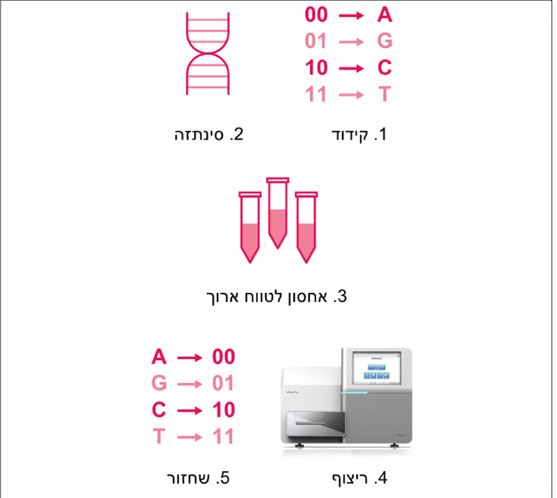

# Quick overview of the coolest things taught in this course
## Hopfield Neural Networks
Probably the best part.
Hopfield network is like

## RBM - Restricted Boltzman Machine
Here we actually teach 

## Cellular Automata (Game of Life, etc.)

## Molecular Computation
Did you ever wanted to solve NP-Hard problems? (For those not familiar, ~~go educate yourself~~ NP-Hard problems are basically problems that don't have, as far as we know, a polynomial solution, thus cannot be solved in a feasable time).

So guess what, you can! 
With some test tubes and nicely syntesized mollecules:)
(OK, not really, but maybe one day?).
That is what this section talks about.

### PCR
This procedure is for **amplification**.
It allows us to create a nice amount of copies of a certain sequence,
so we can easily recognize it later.
Done automatically by:
1. <u>Denaturation</u>: Divide 2 DNA strands by heating to 95°C.
2. 

## DNA Storage
Humans have always loved storing things - maybe it’s just evolutionary instinct.
Storing digital information is no different, but it comes with its own set of challenges.

One big issue? Technology becomes outdated. Old storage devices need to be replaced, and migrating data takes time and effort.

Moore’s Law famously predicted that the number of transistors on a chip would double every two years - and for a while, that held true. But we're reaching the limits of that growth.

Storage is becoming more expensive, and it consumes *a lot* of energy.

### DNA to the Rescue
DNA is an absolutely mind-blowing way nature stores the genetic blueprint of every living organism.
So what if we could harness it to store our stuff: texts, memes,TikToks?

It could solve some major challenges in data storage:

- <u>Density</u>: DNA stores massive amounts of data in tiny volumes

- <u>Cost</u>: Long-term storage becomes much cheaper

- <u>Mobility</u>: Easy to move or duplicate

- <u>Stability</u> Data lasts for thousands of years

DNA storage uses minimal electricity, requires no constant maintenance, and is incredibly durable.
Copying? Easy. DNA replicates itself every day in living cells.

The process? We encode digital data into DNA sequences made of the nucleotides A, C, G, and T, and store them in a test tube, chilled in a regular fridge.

Pretty cool, right?

