## Cloud Hunting - A Wiz Challenge

[Link to challenges](https://cloudhuntinggames.com/)

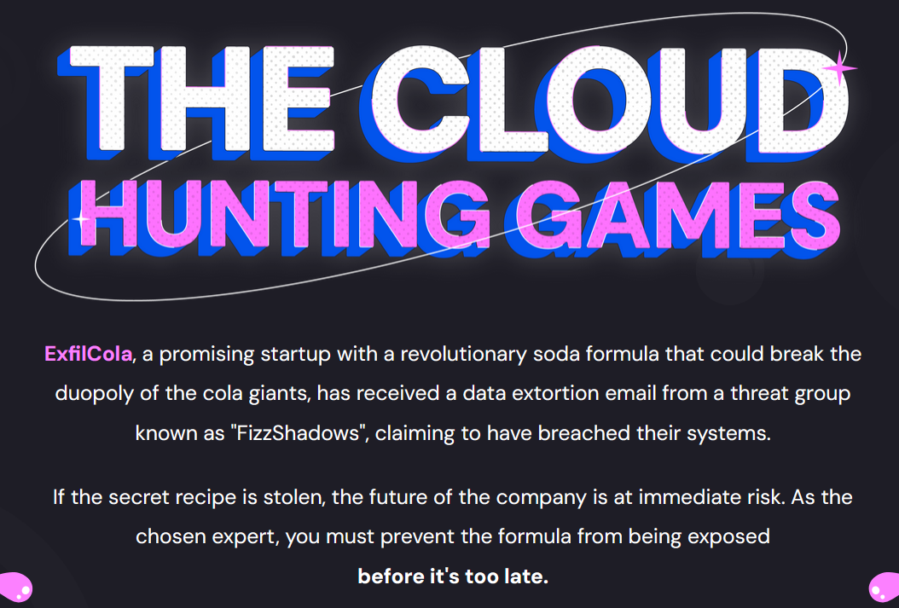

### Challenge 1

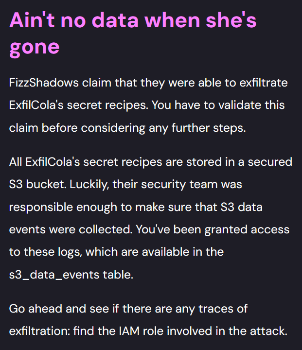

"FizzShadows claim that they were able to exfiltrate ExfilCola's secret recipes. You have to validate this claim before considering any further steps."

So we need to find the log that shows the access to the secret recipes, and IAM role responsible for that access.

An IAM role is an AWS identity with specific permissions that can be assumed by users, services, or applications to perform actions on AWS resources. Unlike a user, a role doesn’t have long-term credentials — instead, it issues temporary credentials when assumed.

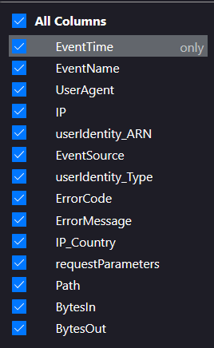

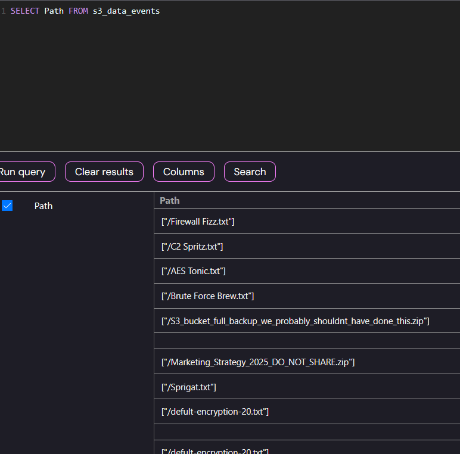

I tried working with the Path, which contains the file the attacker requested from the bucket: `SELECT * FROM s3_data_events where Path Like '%secret%'`

It yielded about 20 results, and one of them is:

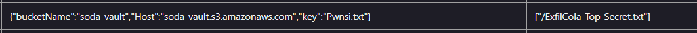

With the IAM role (in the userIdentity_ARN column)

arn:aws:sts::509843726190:assumed-role/S3Reader/drinks

### Challenge 2

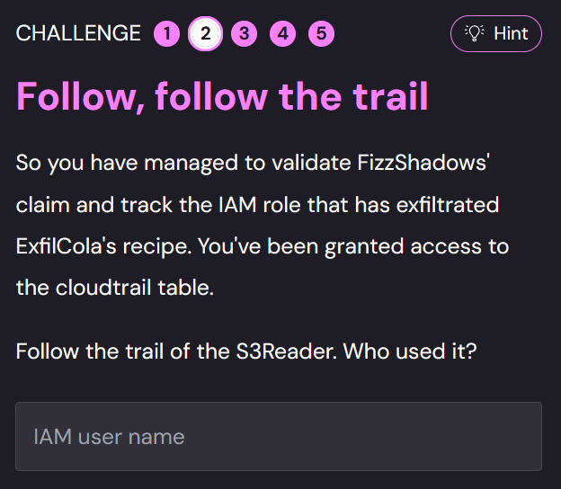

This time, we are given access to the **cloudtrail** logs.
We can see every API action performed in the AWS environment,including who assumed roles, when they did it, and what actions they performed using those roles.

We need to follow the IAM role **S3Reader** and find out the username that used it.

First I tried:
`SELECT * FROM cloudtrail WHERE useridentity_ARN LIKE '%s3Reader%'`

Which of course yields no results, since useridentity_ARN contains the role of the user who assumes the new role, *before* it gets it.
We need to look for S3Reader role in the request parameters:

`SELECT * FROM cloudtrail WHERE requestParameters LIKE '%S3Reader%'`

We again get about 20 results, most of them contain the usernames 	jack.becker and dean.d, but exactly one of the results is:

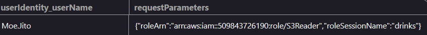

Which is also the only one with the session name **drinks** 😊

So the answer is *Moe.Jito*.

### Challenge 3

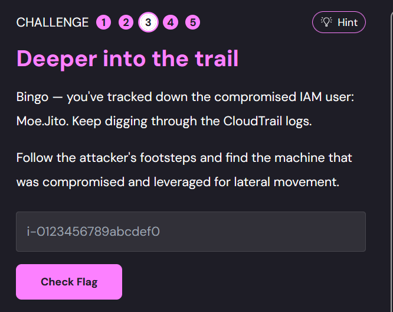

Here, we need to find the original machine that allowed the attacker to access the network and be leveraged to lateral movement (access the IAM user Moe.Jito).

They do give us the pattern of the compromised machine, which is the ID of an EC2 machine. 
I performed the query:

`SELECT * FROM cloudtrail WHERE userIdentity_ARN like '%i-%'`

And one of the results was:

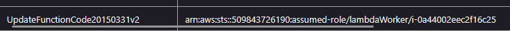

Which stands out because of the *lambda* and the UpdateFunctionCode request.

Turns out it was the compromised machine - i-0a44002eec2f16c25.

### Challenge 4

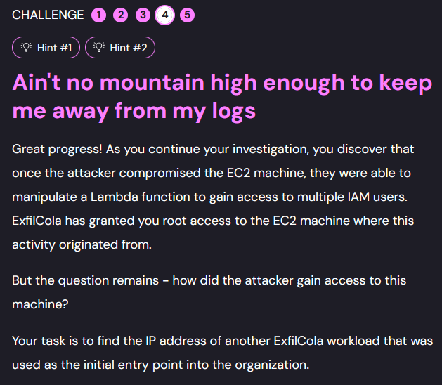

Here, we are given full access to the EC2 machine that was compromised.
The task is to find the IP of the attacker, so obivously we need to look for logs.

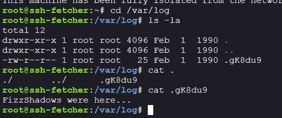

No logs for us, but at least we know the nickname of the attacker.

From the name of the challenge (and from the hints😄), we can guess that running `findmnt` would be useful.

This command shows us the current mount points on the system.
By inspecting the output, we might be able to locate hidden or layered directories—especially ones mounted over sensitive paths like /var/log—which could explain why certain logs appear missing or tampered with.

So basically running `umount /var/log` restores the logs.

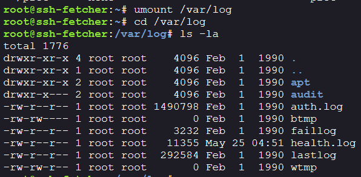

We can print the lastlog:

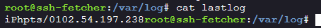

Which appears to be the attacker's IP